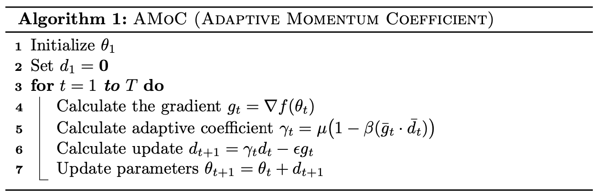

# AMoC (Adaptive Momentum Coefficient for Neural Network Optimization)

## About

The code accompanying our **ECML-PKDD 2020** paper [Adaptive Momentum Coefficient for Neural Network Optimization](https://bitbucket.org/ghentdatascience/ecmlpkdd20-papers/raw/master/RT/sub_1005.pdf).

## Summary

***Adaptive Momentum Coefficient (AMoC)*** utilizes the *inner product* of the gradient and the previous update to the parameters, to effectively control the amount of weight put on the *momentum* term based on the change of direction in the optimization path. It is *easy to implement* and its computational overhead over momentum methods is negligible. Extensive empirical results on both *convex* and *neural network* objectives show that AMoC performs well in practise and compares favourably with other first and second-order optimization algorithms.

The algorithm is the following:

## Contents

The repository contains the implementation of the **AMoC** optimizer along with the *Deep Autoencoder* experiments included in the paper. 

Variables and hyperparameters can be modified in the scripts. The requirements are **Python 3.8**, **Pytorch 1.4.0** along with **CUDA 10.1** and **CuDNN 7.6.3**.
